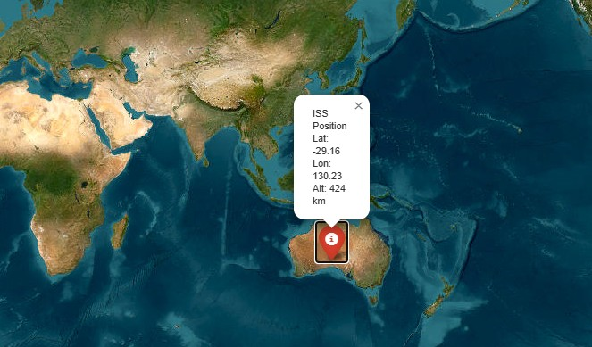

# Satellite Orbit & Earth Observation


*Personal project - work in progress*

I am a Master's student in Applied Mathematics and Data Science.
I created this project to learn more about the space sector and to practice data science with real satellite data.
The main goal is to build a small Python project around satellite data, from orbital data to Earth observation images.

## What I want to explore

- TLE data and satellite orbits
- SGP4 for orbit propagation
- Python data processing
- QGIS and geospatial data
- Sentinel-2 satellite images
- RGB images and NDVI
- Machine learning

## Technologies

Python, Git, GitHub, SGP4, Astropy, QGIS, Sentinel-2, Scikit-learn

## About the project

This is a personal learning project. I will improve it step by step and add new parts as I learn more about satellite data and Earth observation.

## Project Structure

```text
.
├── data/
│   └── raw/
│       └── iss.txt
├── src/
│   ├── ingestion/
│   │   └── load_tle.py
│   └── orbital.py
├── .gitignore
├── README.md
└── requirements.txt
```
